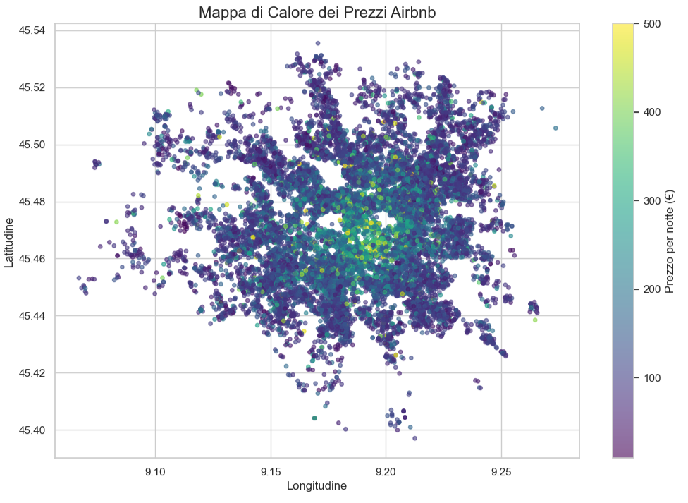
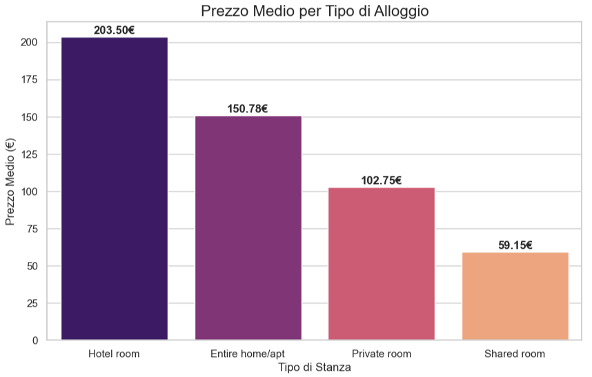
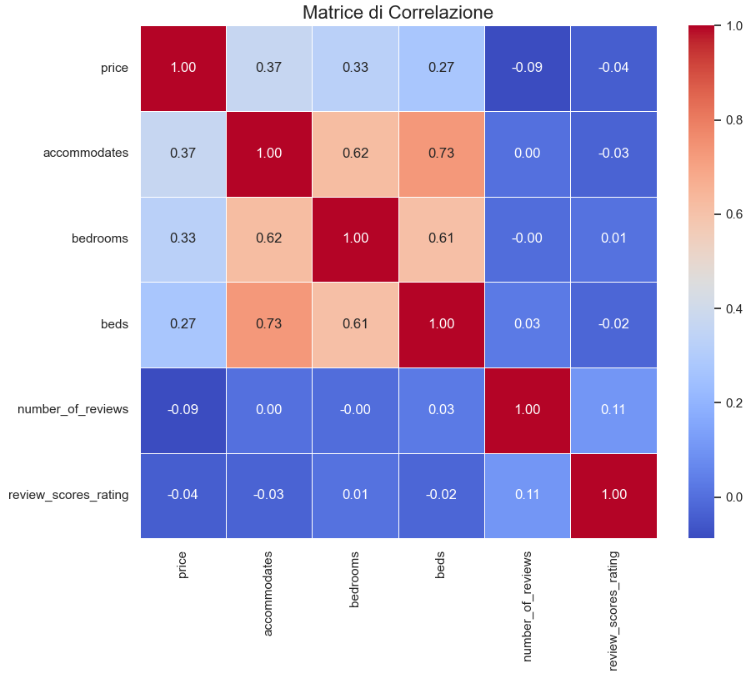

# 🏠 Airbnb Price Predictor: Data Science Project

## 📌 Panoramica
Questo progetto analizza i dati di Airbnb per prevedere il prezzo per notte degli alloggi. L'obiettivo è identificare quali fattori (posizione, dimensioni, recensioni) influenzano maggiormente il mercato e costruire un modello di Machine Learning per stimare il prezzo corretto.

## 🛠️ Tech Stack
- **Linguaggio:** Python 3.x
- **Librerie:** Pandas, NumPy (Data Manipulation), Matplotlib, Seaborn (Visualizzazione), Scikit-Learn (Machine Learning).
- **Ambiente:** VS Code, Jupyter Notebook, Gemini

## 📊 Risultati Chiave (EDA)
- **Localizzazione:** La vicinanza al centro è il fattore determinante (mostrato nella Heatmap geografica).
- **Tipologia:** Gli appartamenti interi hanno un premio di prezzo del X% rispetto alle stanze private.
- **Outliers:** È stata necessaria una pulizia per rimuovere annunci sopra i 500€ che falsavano la media.

## 🤖 Il Modello
Ho utilizzato un **Random Forest Regressor**.
- **Miglioramento delle performance:** Partendo da una precisione iniziale ($R^2$) di 0.17, l'integrazione di coordinate geografiche e rating ha portato il punteggio a **0.36**.
- **Errore Medio (MAE):** ~47€.

## 📊 Risultati dell'Analisi

La mappa qui sotto mostra chiaramente come i prezzi si concentrino nelle zone centrali:

Questo grafico mostra la differenza di prezzo per tipologia di alloggio

Infine ecco la matrice di correlazione fra le features

## 🚀 Come utilizzarlo
1. Clonare la repo: `git clone link`
2. Installare le dipendenze: `pip install -r requirements.txt`
3. Aprire il notebook: `jupyter notebook notebooks/01_analysis.ipynb`

